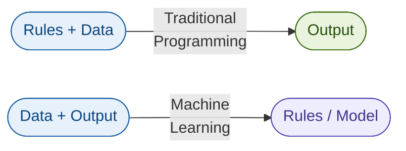
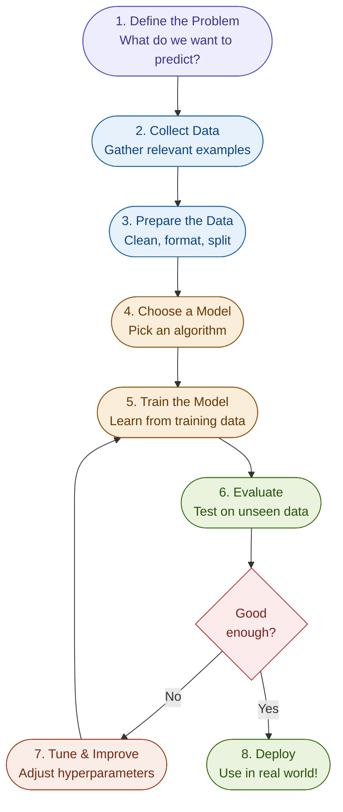
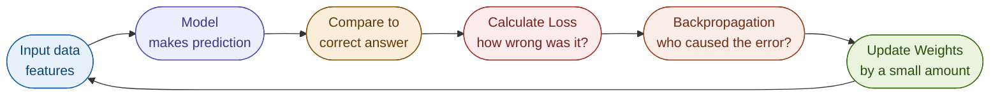
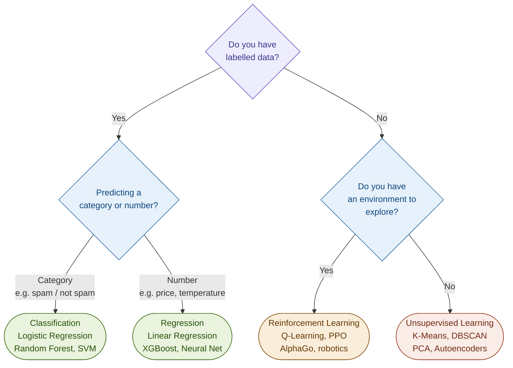
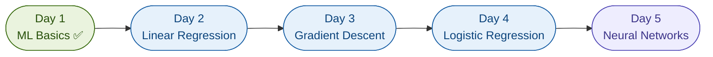

# 🤖 Day 1 — What is Machine Learning?

> **ML Learnings Series** · Building AI/ML systems that solve real-world problems  
> 📅 Day 1 · 📍 Starting from zero · ✍️ by [@ishwaryaaaaaaaaa](https://github.com/ishwaryaaaaaaaaa)

---

## 🧭 What I covered today

- [What is Machine Learning?](#-what-is-machine-learning)
- [How is it different from traditional programming?](#-traditional-programming-vs-machine-learning)
- [The 3 types of Machine Learning](#-the-3-types-of-machine-learning)
- [The ML workflow — how a project actually works](#-the-ml-workflow)
- [Key terms every ML beginner must know](#-key-terms)
- [My first intuition — how a model learns](#-how-a-model-actually-learns)
- [What's next](#-whats-next)

---

## 🤔 What is Machine Learning?

Machine Learning is a way of building systems that **learn from data** instead of following hand-written rules.

Instead of you telling the computer exactly what to do in every situation, you show it thousands of examples — and it figures out the pattern on its own.

> **Simple definition:**  
> *Give a computer enough examples, and it learns to make decisions by itself.*

**Real world examples you already use:**
- Netflix recommending your next show → trained on what millions of users watched
- Gmail filtering spam → trained on millions of labelled spam/not-spam emails  
- Google Translate → trained on billions of sentence pairs across languages
- Your phone unlocking with your face → trained on facial features

---

## ⚔️ Traditional Programming vs Machine Learning



| | Traditional Programming | Machine Learning |
|---|---|---|
| You provide | Rules + Data | Data + Examples |
| Computer produces | Output/Answers | The Rules itself |
| Good for | Fixed logic (tax calculator) | Complex patterns (face recognition) |
| Breaks when | Rules get too complex | You don't have enough data |

---

## 🌳 The 3 Types of Machine Learning

```mermaid
flowchart TD
    ML([Machine Learning]) --> S([Supervised Learning])
    ML --> U([Unsupervised Learning])
    ML --> R([Reinforcement Learning])

    S --> S1([Labelled data\nInput + correct answer])
    S --> S2([Classification\nSpam or not spam?])
    S --> S3([Regression\nWhat will the price be?])

    U --> U1([Unlabelled data\nNo correct answer given])
    U --> U2([Clustering\nGroup similar customers])
    U --> U3([Dimensionality Reduction\nSimplify complex data])

    R --> R1([Agent + Environment\nNo dataset needed])
    R --> R2([Learns by reward\nGame score, profit])
    R --> R3([Used in robotics\nAlphaGo, self-driving])

    style ML fill:#EEEDFE,stroke:#534AB7,color:#3C3489
    style S fill:#E6F1FB,stroke:#185FA5,color:#0C447C
    style U fill:#EAF3DE,stroke:#3B6D11,color:#27500A
    style R fill:#FAEEDA,stroke:#854F0B,color:#633806
    style S1 fill:#E6F1FB,stroke:#185FA5,color:#0C447C
    style S2 fill:#E6F1FB,stroke:#185FA5,color:#0C447C
    style S3 fill:#E6F1FB,stroke:#185FA5,color:#0C447C
    style U1 fill:#EAF3DE,stroke:#3B6D11,color:#27500A
    style U2 fill:#EAF3DE,stroke:#3B6D11,color:#27500A
    style U3 fill:#EAF3DE,stroke:#3B6D11,color:#27500A
    style R1 fill:#FAEEDA,stroke:#854F0B,color:#633806
    style R2 fill:#FAEEDA,stroke:#854F0B,color:#633806
    style R3 fill:#FAEEDA,stroke:#854F0B,color:#633806
```



### 1. 🔵 Supervised Learning
You give the model **labelled data** — every example has an input AND the correct answer.

```
Input: Email text              →   Label: "spam" or "not spam"
Input: House size, location    →   Label: $450,000 (price)
Input: Image of a cat/dog      →   Label: "cat" or "dog"
```

The model learns to map inputs → correct outputs. Most real-world ML is supervised.

### 2. 🟢 Unsupervised Learning
You give the model **unlabelled data** — no correct answers. It finds hidden patterns itself.

```
Input: 1 million customer purchase histories   →   Output: 5 distinct customer segments
Input: All your news articles                  →   Output: automatically grouped by topic
```

### 3. 🟡 Reinforcement Learning
No dataset at all. An **agent** takes actions in an **environment**, gets rewards or penalties, and learns the best strategy over time.

```
Agent: Chess AI      Environment: Chess board
Action: Move a piece    Reward: +1 for winning, -1 for losing
```

Used in: game AI (AlphaGo), robotics, self-driving cars.

---

## 🔄 The ML Workflow

Every ML project — from spam detection to a self-driving car — follows this same cycle:



### Breaking down each step

**Step 1 — Define the problem**  
Before touching any code, ask: *What exactly do I want to predict?* Who is a customer likely to churn? Is this image a tumour? What's the sentiment of this review?

**Step 2 — Collect data**  
ML is only as good as its data. Sources: databases, APIs, web scraping, public datasets (Kaggle, HuggingFace, UCI).

**Step 3 — Prepare the data**  
Real data is messy. This step takes 60–80% of a real ML project's time.
- Remove duplicates and nulls
- Encode categories (Male/Female → 0/1)
- Normalize numbers (so 1,000,000 salary doesn't dominate 25 age)
- Split into **train set** (80%) and **test set** (20%)

**Step 4 — Choose a model**  
Pick an algorithm that fits your problem type. Logistic Regression for simple classification, Random Forest for structured data, Neural Networks for images and text.

**Step 5 — Train**  
Feed the training data through the model. It adjusts its internal weights to minimize prediction error. This is where the "learning" happens.

**Step 6 — Evaluate**  
Run the trained model on the **test set** (data it has never seen). Measure accuracy, precision, recall, F1-score depending on your problem.

**Step 7 — Tune**  
If not good enough, adjust hyperparameters, add more data, or try a different algorithm. Repeat.

**Step 8 — Deploy**  
Wrap the model in an API, app, or service. Ship it to the real world.

---

## 🔑 Key Terms

| Term | Simple Explanation |
|---|---|
| **Feature** | An input variable. For house price: `size`, `location`, `bedrooms` |
| **Label / Target** | The thing you're predicting. For house price: the `price` |
| **Model** | A mathematical function that maps features → label |
| **Training** | Showing the model examples so it adjusts its weights |
| **Weights/Parameters** | Numbers inside the model that get tuned during training |
| **Loss function** | Measures how wrong the model's predictions are |
| **Epoch** | One full pass through the entire training dataset |
| **Overfitting** | Model memorized training data, fails on new data |
| **Underfitting** | Model is too simple, fails even on training data |
| **Hyperparameters** | Settings you choose before training (learning rate, layers) |
| **Inference** | Using a trained model to make predictions on new data |

---

## 🧠 How a Model Actually Learns

The learning loop underneath every ML model — from linear regression to GPT:



1. **Predict** — model guesses an answer from the input
2. **Compare** — compare guess vs the real answer
3. **Loss** — calculate a number that represents how wrong the guess was
4. **Backprop** — trace back through the model to figure out which weights caused the error
5. **Update** — nudge those weights slightly in the right direction
6. **Repeat** — do this millions of times until loss is tiny

> This loop is called **Gradient Descent** — the model is always trying to roll downhill toward the minimum error.

---

## 🗺️ How to Choose: Which Type of ML?



---

## 💭 My Thoughts After Day 1

The thing that clicked for me today: **ML is not magic, it's optimization.**

Every model, no matter how complex — from a simple linear regression to GPT-4 — is doing the same thing: adjusting numbers (weights) to minimize a score (loss). The architecture changes, the scale changes, but the loop is always the same: predict → measure error → adjust → repeat.

The part I want to understand next: *how exactly does backpropagation work? How does the model know which weight to blame for the error?*

---

## 📚 Resources I used today

- [But what is a neural network? — 3Blue1Brown](https://www.youtube.com/watch?v=aircAruvnKk)
- [Machine Learning — Andrew Ng (Coursera)](https://www.coursera.org/learn/machine-learning)
- [Kaggle Intro to ML](https://www.kaggle.com/learn/intro-to-machine-learning)
- [Scikit-learn docs](https://scikit-learn.org/stable/)

---

## ➡️ What's Next



---

*Part of my [ML-Learnings](https://github.com/ishwaryaaaaaaaaa/ML-Learnings-) series — documenting every day of my ML journey.*  
*If this helped you, drop a ⭐ on the repo!*
